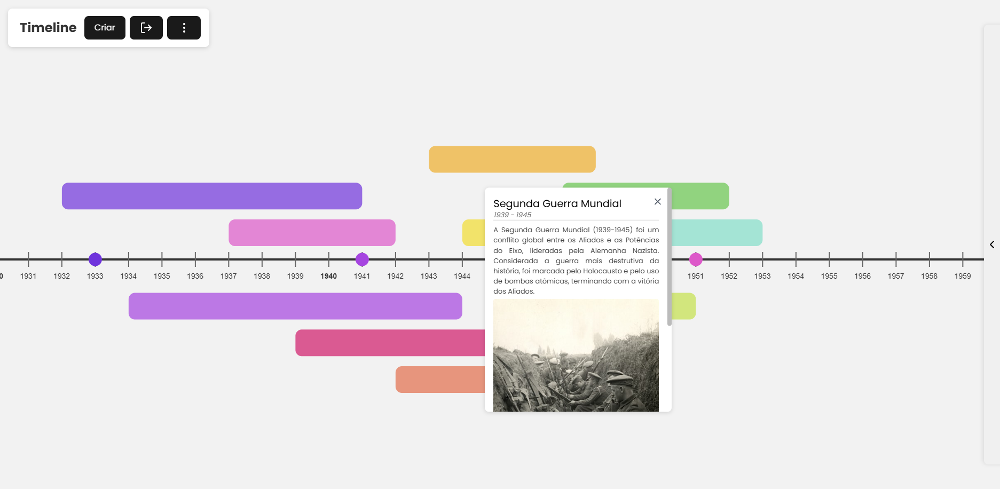

# 🗓️ Timeline - Build, Explore and Share Your Histories with Style

## 📌 Overview

**Timeline** is an interactive web application for creating, **viewing, and editing historical, scientific, or personal timelines**.

Users can add periods and events, customize **colors, themes, and layers**, export/import data, and view item details. The project uses React, `Zustand` for state management, and `react-konva` for graphical rendering.



## ⚙️ Key Features

- ✅ **Create Periods and Events:** Add periods (time spans) and events (specific points) with title, description, color, and image.
- ✅ **Dynamic Visualization:** Scalable timeline with zoom, drag, keyboard navigation, and adaptive year markers.
- ✅ **Smart Layers:** Periods are automatically arranged into different levels to avoid overlap, with support for negative layers (below the main timeline).
- ✅ **Themes and Colors:** Multiple color themes for visual customization, with optional auto-coloring.
- ✅ **Side Panel:** Interface to add, edit, and view period/event details, including image search and upload.
- ✅ **Export/Import:** Save and load timelines as JSON files.
- ✅ **Advanced Settings:** Adjust spacing, height, base year, event radius, and other preferences.
- ✅ **Auto Description Generation:** AI (Cohere) integration to generate automatic descriptions for periods.
- ✅ **Image Search:** Unsplash integration for image search by keyword.

## 📁 Folder Structure

```
src/
├── components/
│   ├── infocard/         # Detail card for periods/events
│   ├── panels/           # Side panels and toolbar
│   └── timeline/         # Timeline graphical components
├── data/                 # Color themes
├── hooks/                # Custom hooks (zoom, handlers)
├── lib/                  # Date utilities
├── pages/                # Main pages (Timeline)
├── services/             # External integrations (Unsplash, Cohere)
├── store/                # Zustand stores (global state)
├── types/                # TypeScript types (Period, Event)
└── utils/                # Utility functions (colors, layers, export)
```

## 🧩 Main Components

### 1. **TimelineAxis & TimelineStage**

- Render the main timeline, year markers, periods, and events.
- Support zoom, drag, and keyboard navigation.

### 2. **PeriodsLoader & EventsLoader**

- Load and render all saved periods and events.

### 3. **Period & Event**

- Visually represent each period (rectangle) and event (circle) on the timeline.
- Support interactions: hover (show details), click (open edit panel).

### 4. **InfoCard**

- Displays details of the selected period/event, with delete option.

### 5. **SidePanel**

- Side panel for adding or editing periods/events.
- Supports selecting type (period/event), color, image (link, search, upload), dates, and description.
- Integrated with AI to generate automatic descriptions.

### 6. **Toolbar**

- Top bar with buttons to create items, export/import, colorize, adjust layers, and access settings.

### 7. **SettingsModal**

- Settings modal to adjust visual and functional parameters of the timeline.

## 🧠 State Management

- **Zustand** is used to manage the global state of:
  - Periods and events (`periodsEventsLoaderStore`)
  - Timeline settings (`settingsStore`)
  - Side panel state (`sidePanelStore`)
  - Focused detail cards (`detailsBalloonStore`)
  - Zoom and stage position (`stageControlsStore`)

## 🧾 Main Types

```typescript
// Period
interface Period {
  id: string;
  title: string;
  description: string;
  image: string;
  color: string;
  start: SimpleDate;
  end: SimpleDate;
  level: number;
}

// Event
interface Event {
  id: string;
  title: string;
  description: string;
  image: string;
  color: string;
  date: SimpleDate;
}
```

## 🧪 Example Exported JSON

```json
{
  "id": "01K19T51ZH3F654H1S8SK69PES",
  "title": "Pandemic",
  "description": "On March 11, 2020, COVID-19 was characterized by the WHO as a pandemic due to its wide geographical spread. On May 5, 2023, the WHO declared the end of the Public Health Emergency of International Concern (PHEIC) for COVID-19.",
  "image": "https://images.unsplash.com/photo-1584036561566-baf8f5f1b144?...",
  "color": "#225c77",
  "start": "2019-01-01",
  "end": "2021-01-01",
  "level": 1
}
```

## 🔄 Usage Flow

1. **Add Period/Event:** Click "Create" in the toolbar, fill the form in the side panel, and save.
2. **Edit:** Click on a period/event on the timeline to open the editing panel.
3. **View Details:** Hover over an item to see the InfoCard.
4. **Export/Import:** Use the download/upload icons in the toolbar.
5. **Settings:** Adjust themes, spacing, layers, and other preferences in the settings modal.

## 🎨 Customization

- 🖍️ **Themes:** Choose from several color themes or create your own.
- 📐 **Layers:** Enable negative layers for periods below the main line.
- 🖌️ **Auto Coloring:** Automatically color new items upon creation.
- 🔧 **Layout Adjustment:** Modify period height, spacing, event radius, base year, and more.

## 🌐 Integrations

- **Unsplash:** Image search for periods/events.
- **Cohere:** Automatic description generation in Portuguese.

## 📤 Export / Import

- **Export:** Saves periods and events to a JSON file.
- **Import:** Loads a JSON file and updates the timeline.

## 🛠️ Technologies Used

- **React** (with TypeScript)
- **Zustand** (global state)
- **react-konva** (interactive canvas)
- **Axios** (HTTP requests)
- **ULID** (unique IDs)
- **Cohere API** (AI for text)
- **Unsplash API** (images)

## 🖥️ Running Locally

1. Install dependencies:

   ```bash
   npm install
   ```

2. Configure API keys (Unsplash and Cohere) in `.env`.
3. Run the project:

   ```bash
   npm run dev
   ```

4. Open in `http://localhost:3000` (or configured port).

## ❗ Notes & FAQ

### ❓ How do I add a period or event to the timeline?

Click the "Create" button on the top toolbar. Then, fill out the side panel form with title, description, dates, image, and color. Choose between event or period, save — and done!

### ❓ What is auto description generation and how does it work?

Timeline is integrated with the **Cohere** API, an AI service that can generate automatic descriptions for events or periods based on their title and dates. This feature is available in the side panel while editing or creating an item.

### ❓ Can I export and share my timeline with other users?

Yes! You can use the export function to save your timeline as a `JSON` file. This file can be shared or re-imported by other users using the same application, preserving all data and settings.

## 🤝 Contribution

Contributions are welcome! Follow these steps:

1. Fork this repository.
2. Create a new branch (`git checkout -b feature-my-feature`).
3. Commit your changes (`git commit -m 'Add my feature'`).
4. Push to the branch (`git push origin feature-my-feature`).
5. Open a Pull Request.

---

Developed with 💙 by [Guilherme Roesler](https://github.com/GuilhermeRoesler)
